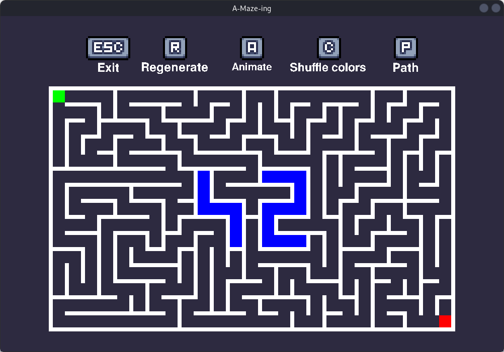
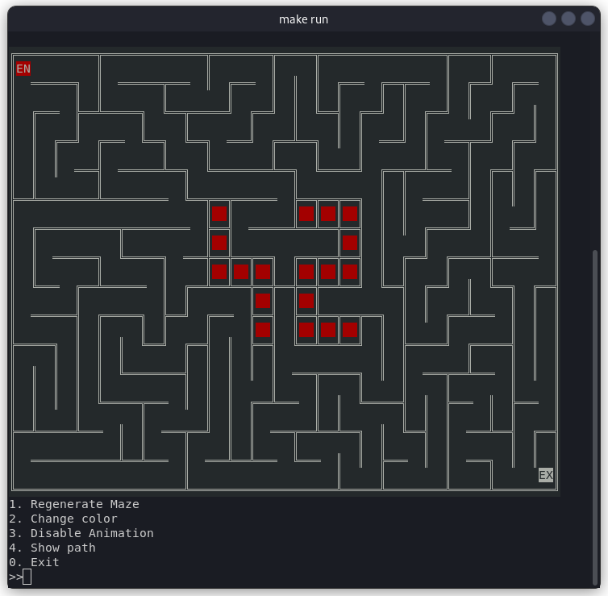
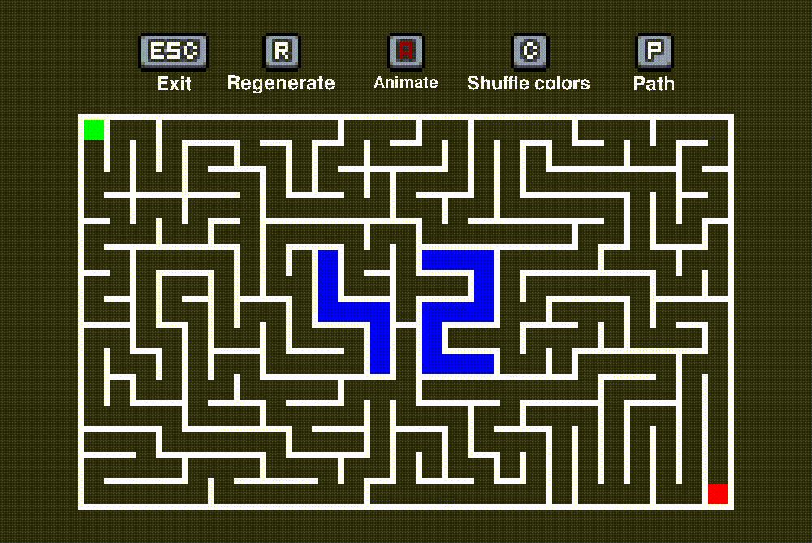

*This project has been created as part of the 42 curriculum by smahraz, smakkass.*

---

# A-Maze-ing

A maze generation program with graphical and terminal-based visualization, animation support, and path finding capabilities.

---

## Table of Contents

- [Description](#description)
- [Features](#features)
- [Instructions](#instructions)
  - [Requirements](#requirements)
  - [Installation](#installation)
  - [Usage](#usage)
- [Configuration File](#configuration-file)
- [Maze Generation Algorithms](#maze-generation-algorithms)
- [Reusable Components](#reusable-components)
- [Advanced Features](#advanced-features)
- [Team and Project Management](#team-and-project-management)
- [Resources](#resources)

---

## Description

A-Maze-ing is a maze generation and visualization tool developed in Python. The program generates rectangular mazes using configurable algorithms, displays them through either a graphical user interface (GUI) or a text-based terminal interface (TUI), and supports animated generation as well as path finding from entry to exit.

The project is structured as a modular application with a reusable maze generation library (`mazegen`) that can be installed independently.

---

## Features

- Rectangular maze generation with configurable dimensions
- Two generation algorithms: DFS and Prim
- Perfect and imperfect maze options
- GUI and TUI display modes
- Step-by-step generation animation
- Path finding from entry to exit
- Configurable entry and exit positions
- Reproducible results via seed configuration
- Maze export to file

---

## Instructions

### Requirements

- Python 3.10 or higher
- Minilibx (mlx-*.whl)

### Installation

1. Clone the repository:
```bash
git clone https://github.com/smahraz/A-Maze-ing.git
cd A-Maze-ing
```

2. Install dependencies:
```bash
make install
```
**Note:** you can find mlx package inside __releases__.
### Usage

Run with the default configuration:
```bash
make run
```

Or specify a custom configuration file:
```bash
python3 a_maze_ing.py <config_file>
```

Example:
```bash
python3 a_maze_ing.py default_config.txt
```

---

## Configuration File

The configuration file uses a simple `KEY=VALUE` format. Lines starting with `#` are comments.

### Structure

```
# Comment lines start with #
KEY=VALUE
```

### Available Options

| Key | Required | Description | Default |
|-----|----------|-------------|---------|
| `WIDTH` | Yes | Maze width (Greater than 8) | - |
| `HEIGHT` | Yes | Maze height (Greater than 6) | - |
| `ENTRY` | Yes | Starting position (format: `x,y`) | - |
| `EXIT` | Yes | Ending position (format: `x,y`) | - |
| `OUTPUT_FILE` | Yes | Path to save the generated maze | - |
| `PERFECT` | Yes | Perfect maze with single solution (`True`/`False`) | - |
| `SEED` | No | Random seed for reproducible generation | Random |
| `ALGORITHM` | No | Generation algorithm (`DFS` or `PRIM`) | `DFS` |
| `INTERFACE` | No | Display mode (`gui` or `tui`) | `gui` |

### Example Configuration

```
WIDTH=25
HEIGHT=15
ENTRY=10,10
EXIT=1,1
OUTPUT_FILE=maze.txt
PERFECT=False
SEED=1234567
ALGORITHM=DFS
INTERFACE=gui
```

---

## Maze Generation Algorithms

### Implemented Algorithms

**Depth-First Search (DFS)**
- Creates long, winding passages
- Produces aesthetically pleasing maze patterns
- Simple implementation

**Prim's Algorithm**
- Creates more uniform, branching patterns
- Produces visually appealing animations during generation

### Why We Chose Both

Each algorithm has distinct strengths:

- **DFS** produces more visually appealing final mazes with long corridors and is simpler to implement. It is recommended for general use.
- **Prim** generates mazes with more uniform branching and looks impressive when animated.

We implemented both to give users flexibility based on their preferences and use cases.

---

## mazegen Library

The `mazegen/` module is a standalone, reusable maze generation library with **no external dependencies**. It can be installed and used independently in any Python project.

### Installation

```bash
pip install mazegen-*.whl
```

### Quick Start

```python
from mazegen import MazeGenerator

# Create and generate a maze
gen = MazeGenerator(width=20, height=10, algorithm="DFS", perfect=True, seed=42, entry=(0, 0), exit=(19, 9))
maze = gen.generate_maze()

# Find solution path
path = MazeGenerator.generate_path(maze)
print("Solution:", "".join(direction for _, direction in path))
```

### Constructor Parameters

```python
MazeGenerator(
    width: int,          # Maze width (columns)
    height: int,         # Maze height (rows)
    algorithm: str,      # "DFS" or "PRIM"
    perfect: bool,       # True = no loops, False = some extra passages
    seed: int,           # Random seed for reproducibility
    entry: tuple[int, int],  # Starting cell (x, y)
    exit: tuple[int, int]    # Ending cell (x, y)
)
```

| Parameter | Type | Description |
|-----------|------|-------------|
| `width` | `int` | Number of columns (must be > 0) |
| `height` | `int` | Number of rows (must be > 0) |
| `algorithm` | `str` | Generation algorithm: `"DFS"` or `"PRIM"` |
| `perfect` | `bool` | `True` for single-solution maze, `False` for additional openings |
| `seed` | `int` | Random seed for reproducible generation |
| `entry` | `tuple[int, int]` | Entry coordinates `(x, y)` |
| `exit` | `tuple[int, int]` | Exit coordinates `(x, y)` |

### Accessing the Generated Structure

```python
from mazegen import MazeGenerator

gen = MazeGenerator(width=10, height=8, algorithm="DFS", perfect=True, seed=123, entry=(0, 0), exit=(9, 7))
maze = gen.generate_maze()

# Access the 2D grid of cells
grid = maze.map  # list[list[Cell]]

# Access specific cell
cell = grid[y][x]

# Check wall states
print(f"North wall closed: {cell.north.is_closed}")
print(f"East wall closed: {cell.east.is_closed}")

# Access neighbors
north_cell = cell.above_cell  # Cell or None
south_cell = cell.below_cell
east_cell = cell.right_cell
west_cell = cell.left_cell
```

### Finding the Solution Path

```python
from mazegen import MazeGenerator

gen = MazeGenerator(width=20, height=15, algorithm="DFS", perfect=True, seed=42, entry=(0, 0), exit=(19, 14))
maze = gen.generate_maze()

# Get solution path (list of (Cell, direction) tuples)
path = MazeGenerator.generate_path(maze)

# Directions: 'N' (north), 'S' (south), 'E' (east), 'W' (west)
for cell, direction in path:
    print(f"From ({cell.x}, {cell.y}) go {direction}")

# Get solution as direction string
solution = "".join(direction for _, direction in path)
print(f"Solution: {solution}")
```

### Generation with Animation Steps

```python
from mazegen import MazeGenerator

gen = MazeGenerator(width=10, height=10, algorithm="DFS", perfect=True, seed=123, entry=(0, 0), exit=(9, 9))

# Get maze and steps for animation
maze, steps = gen.generate()

# Each step contains: x, y, wall (direction opened)
for step in steps:
    print(f"Step at ({step.x}, {step.y}), opened wall: {step.wall}")
```

### Available Methods

| Method | Returns | Description |
|--------|---------|-------------|
| `generate_maze()` | `Maze` | Generate maze without recording steps |
| `generate()` | `tuple[Maze, list[Step]]` | Generate maze with animation steps |
| `generate_steps()` | `list[Step]` | Generate and return only the steps |
| `generate_path(maze)` | `list[tuple[Cell, str]]` | Static method - find path from entry to exit |
| `output()` | `str` | Export maze as encoded string with solution |
| `reseed()` | `None` | Assign a new random seed |

---

## Advanced Features

### Graphical User Interface (GUI)

A full graphical interface for maze visualization with:
- Real-time maze rendering
- Path visualization
- Interactive controls

<p align="center">
  
</p>

### Text User Interface (TUI)

A terminal-based interface featuring:
- ANSI color rendering
- Animated maze generation
- Path display toggle
- Color theme cycling

<p align="center">
  
</p>

### Generation Animation

Both interfaces support step-by-step visualization of the maze generation process.

<p align="center">
  
</p>

### Multiple Algorithms

Users can switch between DFS and Prim algorithms via the configuration file to achieve different maze characteristics.

---

## Team and Project Management

### Team Members and Roles

| Member | Role |
|--------|------|
| **smahraz** | TUI development, maze algorithms (DFS), build configuration |
| **smakkass** | GUI development, parser, path finding, PRIM algorithm |

### Planning and Evolution

**Initial Approach:**
Each team member claimed the parts they were most interested in working on. After individual implementation, we collaborated to fix bugs, improve code style, and ensure consistency.

**Communication:**
Frequent communication was maintained throughout the project to coordinate integration and resolve issues promptly.

### What Worked Well

- Code from each team member integrated smoothly with the other's work
- Clear division of responsibilities allowed parallel development
- Regular communication prevented integration issues

### Areas for Improvement

- Code efficiency could be optimized further

### Tools Used

- **Git** for version control and collaboration

---

## Resources

### References

- [Maze Generation: Prim's Algorithm - Jamis Buck](https://weblog.jamisbuck.org/2011/1/10/maze-generation-prim-s-algorithm)
- [Maze Generation Algorithm Overview (YouTube)](https://www.youtube.com/watch?v=Y37-gB83HKE)
- [Maze Algorithms Visualization (YouTube)](https://www.youtube.com/watch?v=uctN47p_KVk)

### AI Usage

AI tools were used in this project for:
- **Debugging**: Locating stubborn logic bugs that were difficult to identify manually
- **Learning**: Understanding new Python concepts and best practices

AI was not used for generating core algorithm implementations or project architecture.

---
